# 系统架构设计

> 版本：1.0 | 日期：2026-06-29 | 基于需求规格 v1.0 + 数据模型设计

---

## 目录

1. [系统组件图](#一系统组件图)
2. [核心数据流](#二核心数据流)
3. [部署架构](#三部署架构)
4. [架构决策记录 (ADR)](#四架构决策记录)

---

## 一、系统组件图

### 1.1 整体架构

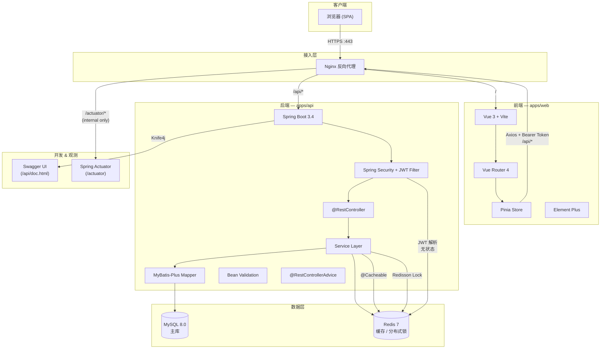

### 1.2 后端分层架构

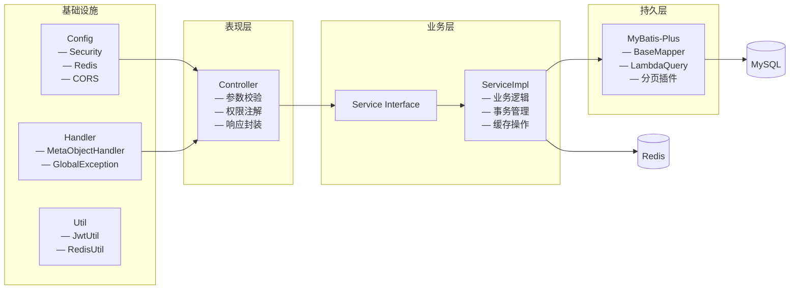

### 1.3 依赖关系矩阵

| 组件        | 依赖                | 说明                                     |
| ----------- | ------------------- | ---------------------------------------- |
| Vue 3 前端  | Spring Boot API     | 通过 Nginx 代理 `/api` 请求              |
| Vue 3 前端  | @labreserve/shared  | 共享类型和枚举                           |
| Spring Boot | MySQL 8.0           | 持久化存储，MyBatis-Plus 连接            |
| Spring Boot | Redis 7             | 缓存（@Cacheable）+ 分布式锁（Redisson） |
| Spring Boot | @labreserve/shared  | 类型参考（手动同步，无运行时依赖）       |
| Nginx       | Vue 3 (静态文件)    | 生产环境 serve dist/                     |
| Nginx       | Spring Boot (:8080) | 反向代理 API 请求                        |

---

## 二、核心数据流

### 2.1 用户注册与登录

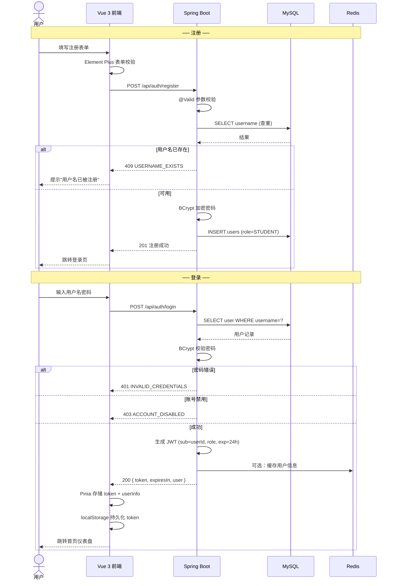

### 2.2 预约生命周期（核心流程）

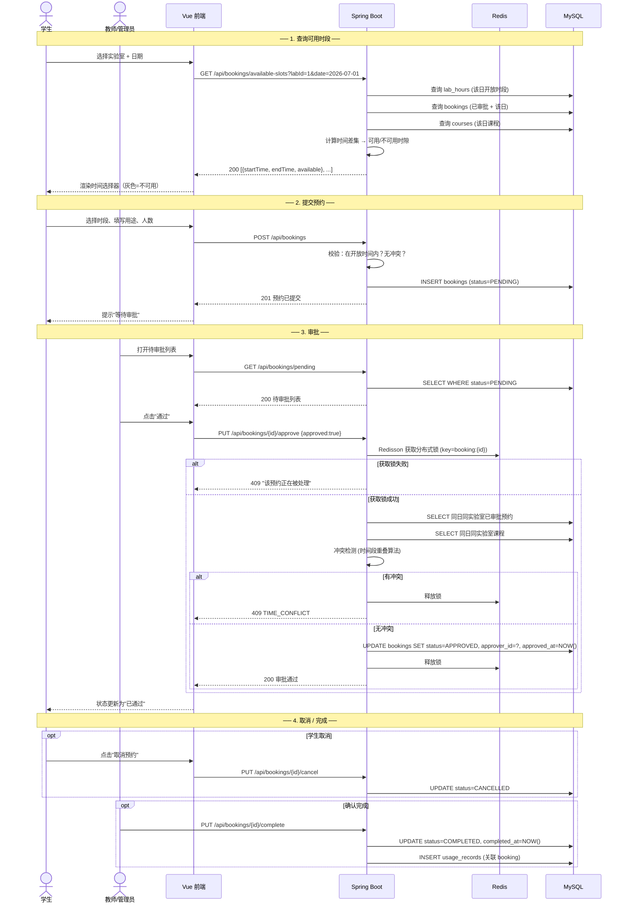

### 2.3 设备借用全流程

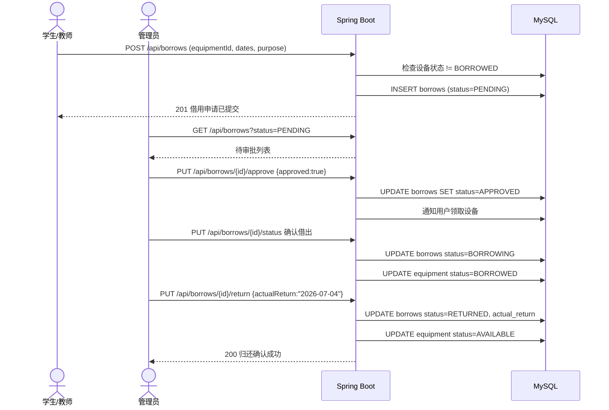

### 2.4 通知发布与送达

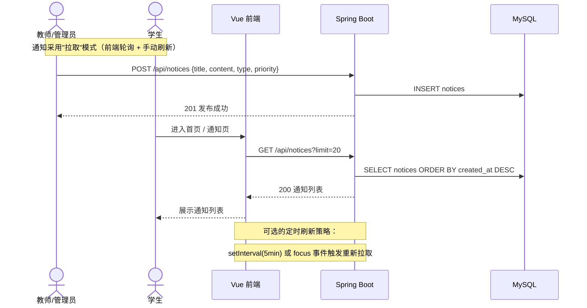

> **设计决策**：MVP 阶段不引入 WebSocket/SSE，通知采用客户端轮询。高优先级通知（如预约审批结果）在前端 API 响应中直接返回状态，无需额外的推送通道。参见 [ADR-003](#adr-003-通知机制选择轮询-vs-websocket)。

### 2.5 统计数据查询

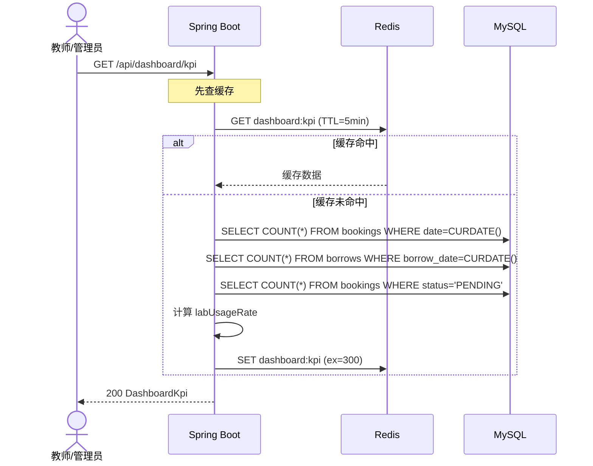

---

## 三、部署架构

### 3.1 环境对比

| 维度      | 本地开发 (dev)              | 联调测试 (staging)          | 生产环境 (production)           |
| --------- | --------------------------- | --------------------------- | ------------------------------- |
| **前端**  | `pnpm dev` Vite HMR :5173   | Docker Nginx serve dist     | Docker Nginx serve dist         |
| **后端**  | `mvn spring-boot:run` :8080 | Docker java -jar            | Docker java -jar (replica ≥ 2)  |
| **MySQL** | Docker :3306，弱密码        | 独立实例，强密码            | 主从 / 云数据库，加密连接       |
| **Redis** | Docker :6379，无密码        | 密码认证                    | 哨兵 / 集群模式                 |
| **日志**  | 控制台 STDOUT               | JSON 格式文件 + 控制台      | 集中式（ELK / Loki）            |
| **监控**  | 无                          | Spring Actuator             | Actuator + Prometheus + Grafana |
| **域名**  | localhost                   | staging.labreserve.local    | labreserve.univ.edu.cn          |
| **SSL**   | 无                          | 可选                        | 必须（Nginx 终止 TLS）          |
| **CI/CD** | 手动                        | GitHub Actions 自动构建镜像 | 手动审批后推送                  |

### 3.2 本地开发环境

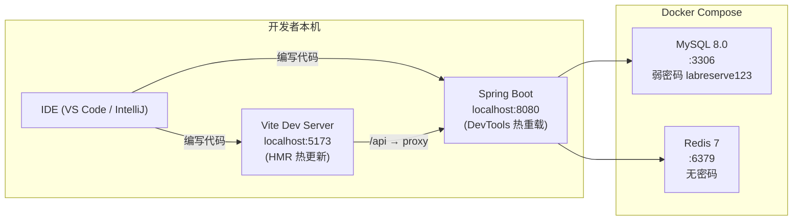

**启动命令：**

```bash
# 1. 启动基础设施
docker compose up -d

# 2. 启动后端（需要 Java 21 + Maven）
cd apps/api && mvn spring-boot:run -Dspring-boot.run.profiles=dev

# 3. 启动前端
pnpm dev:web
```

### 3.3 Staging 环境

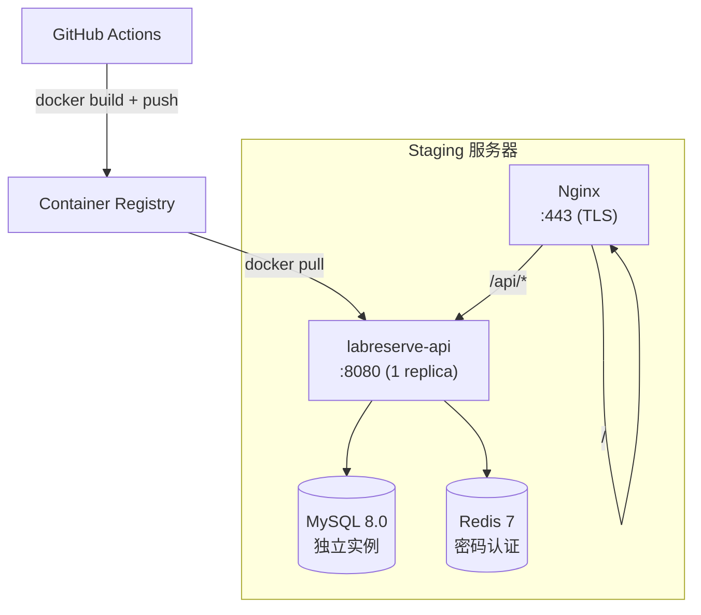

**Docker Compose (staging 额外配置)：**

```yaml
# docker-compose.staging.yml
services:
  api:
    build: ./apps/api
    ports:
      - "8080:8080"
    environment:
      - SPRING_PROFILES_ACTIVE=staging
      - DB_PASSWORD=${DB_PASSWORD}
      - REDIS_PASSWORD=${REDIS_PASSWORD}
      - JWT_SECRET=${JWT_SECRET}
    depends_on:
      mysql:
        condition: service_healthy
      redis:
        condition: service_healthy
```

### 3.4 生产环境

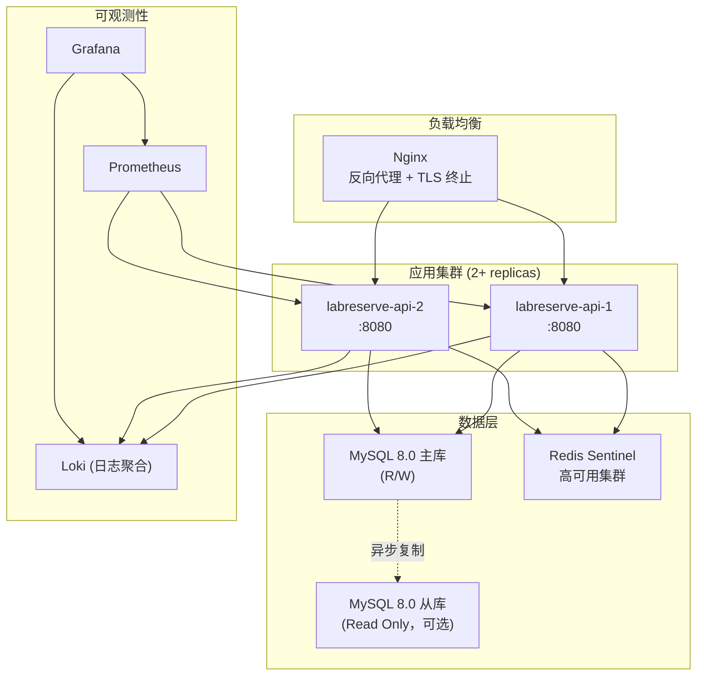

**生产关键配置差异：**

| 配置项                                       | Staging | Production                  |
| -------------------------------------------- | ------- | --------------------------- |
| `server.tomcat.threads.max`                  | 200     | 500                         |
| `spring.datasource.hikari.maximum-pool-size` | 10      | 30                          |
| `logging.level.root`                         | INFO    | WARN                        |
| `mybatis-plus.configuration.log-impl`        | stdout  | none                        |
| `management.endpoints.web.exposure.include`  | `*`     | `health,metrics,prometheus` |

### 3.5 Docker 镜像构建

```dockerfile
# apps/api/Dockerfile (多阶段构建)
FROM maven:3.9-eclipse-temurin-21-alpine AS build
WORKDIR /app
COPY pom.xml .
RUN mvn dependency:go-offline
COPY src/ src/
RUN mvn package -DskipTests

FROM eclipse-temurin:21-jre-alpine
WORKDIR /app
COPY --from=build /app/target/*.jar app.jar
EXPOSE 8080
ENTRYPOINT ["java", "-jar", "app.jar"]
```

### 3.6 CI/CD 流水线

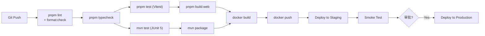

---

## 四、架构决策记录 (ADR)

### ADR-001: 选择 MyBatis-Plus 作为 ORM 框架

- **状态**：已采纳
- **日期**：2026-06-29
- **决策**：使用 MyBatis-Plus 3.5.11 作为持久层框架
- **理由**：
  - 团队对 MyBatis 生态熟悉，学习成本低
  - 开箱即用的 CRUD、分页、逻辑删除、自动填充
  - SQL 完全透明，便于优化时间冲突检测等复杂查询
  - 与 Spring Boot 3.4 集成成熟（mybatis-plus-spring-boot3-starter）
- **后果**：
  - 需手动编写复杂 JOIN 查询
  - 无自动 DDL，需通过 SQL 脚本管理表结构变更
  - 不管理实体关系，关联查询在 Service 层手动组装

---

### ADR-002: 选择 JWT 无状态认证 + Spring Security

- **状态**：已采纳
- **日期**：2026-06-29
- **决策**：使用 JWT (jjwt 库) 实现无状态认证，配合 Spring Security 方法级权限控制
- **理由**：
  - 需求明确要求 JWT 认证（NF-01），token 有效期 24h
  - 无状态设计适合容器化部署，无需 session 同步
  - Spring Security 的 `@PreAuthorize` 注解实现方法级 RBAC
  - 前端 Axios 拦截器统一附加 `Authorization: Bearer <token>`
- **替代方案**：Session + Cookie — 拒绝，原因：需要 sticky session，与容器化多副本部署冲突
- **后果**：
  - 需在 pom.xml 中新增 jjwt-api / jjwt-impl / jjwt-jackson 依赖
  - 需实现 JwtAuthenticationFilter（OncePerRequestFilter）
  - Token 签发后无法主动失效（通过短有效期 + Redis 黑名单缓解）
  - 需实现 SecurityConfig 禁用 session、配置 CORS、放行公开接口

---

### ADR-003: 通知机制选择轮询 vs WebSocket

- **状态**：已采纳
- **日期**：2026-06-29
- **决策**：MVP 阶段使用 HTTP 轮询（客户端定时拉取 /focus 事件刷新），后续引入 Server-Sent Events (SSE)
- **理由**：
  - 通知本身非实时强需求（预约审批结果在 API 响应中即时返回）
  - WebSocket 需额外处理断线重连、心跳、认证握手，增加 MVP 复杂度
  - SSE 比 WebSocket 更轻量（单向推送、自动重连、HTTP 协议兼容），适合通知场景
  - 当前业务的通知频率低（日均 < 20 条），轮询 5 分钟间隔不会造成负载问题
- **替代方案**：
  - WebSocket (STOMP)：P2 阶段考虑，适合需要双向实时通信的场景
  - 长轮询：兼容性好但资源占用高，不采纳
- **后果**：
  - 前端实现 `usePolling` composable，每 5 分钟调用 GET /api/notices
  - 路由切换或页面 focus 事件触发主动刷新
  - 架构预留 SSE 端点（/api/notices/stream），P2 阶段启用

---

### ADR-004: 分页选择 Cursor-based 而非 Offset-based

- **状态**：已采纳
- **日期**：2026-06-29
- **决策**：所有列表接口统一使用 cursor-based pagination
- **理由**：
  - 避免 offset 分页在数据变动时的"翻页漂移"问题
  - 对 MySQL 更友好（`WHERE id > ? LIMIT ?` 走主键索引）
  - 适合移动端"无限滚动"和 Web 端"加载更多"交互模式
  - 符合 RESTful API 最佳实践
- **后果**：
  - 不支持跳页（"第 5 页"），前端需实现"加载更多"或基于游标的翻页
  - 统计总数需要额外的 COUNT 查询（仅在需要时计算 total）
  - 排序字段必须包含在主键或联合索引中以保证一致性

---

### ADR-005: 预约审批使用 Redis 分布式锁

- **状态**：已采纳
- **日期**：2026-06-29
- **决策**：审批操作 (`PUT /bookings/{id}/approve`) 使用 Redisson 分布式锁
- **理由**：
  - 需求 NF-09 明确要求审批环节防并发
  - 生产环境多副本部署时，JVM 内置锁无法跨实例
  - Redisson 提供 `tryLock` + watchdog 自动续期，成熟可靠
  - 锁粒度：`booking:{id}`，仅锁定单条审批操作
- **替代方案**：
  - 数据库悲观锁 (`SELECT ... FOR UPDATE`)：会锁住整个索引范围，并发性差
  - 乐观锁 (version 字段)：用户感知重试，体验不佳
- **后果**：
  - 需在 pom.xml 引入 redisson-spring-boot-starter
  - 需配置 RedissonClient Bean
  - 获取锁失败时返回 409 + "该预约正在被处理"，前端提示用户稍后重试

---

### ADR-006: 配置文件分层策略

- **状态**：已采纳
- **日期**：2026-06-29
- **决策**：使用 Spring Boot 多 profile 文件分离环境配置
- **文件结构**：
  ```
  application.yml              # 公共配置 + dev profile
  application-staging.yml      # staging 环境
  application-production.yml   # 生产环境
  ```
- **理由**：
  - 敏感信息（数据库密码、JWT secret）通过环境变量注入，不进入版本控制
  - Spring Boot 原生支持 `spring.profiles.active` + `--spring.config.location`
  - Docker 部署时通过 `SPRING_PROFILES_ACTIVE` 环境变量切换
- **敏感信息管理**：
  - dev：明文在 application.yml 中（本地 Docker，无外部暴露）
  - staging：`${DB_PASSWORD}`、`${JWT_SECRET}` 占位符 + `.env` 文件（.gitignore）
  - production：通过 Docker Secret 或 K8s Secret 注入

---

### ADR-007: 前端状态管理策略

- **状态**：已采纳
- **日期**：2026-06-29
- **决策**：使用 Pinia 管理全局状态，组件局部状态使用 Composition API
- **Store 划分**：
  - `useAuthStore`：token、userInfo、login/logout 方法
  - `useLabStore`（可选，按需）：当前选中的实验室
  - 其他数据（列表、详情）通过组件内 `ref` + API composable 管理
- **理由**：
  - 避免全局 store 膨胀，大部分数据是"拉取即展示"，不需要跨组件共享
  - Pinia 的 TypeScript 支持优于 Vuex
  - 按需创建 store，未使用的 store 不会被打包
- **后果**：
  - API 请求逻辑封装在 `composables/` 中（如 `useBookings`、`useLabs`）
  - 列表页的数据刷新通过 composable 暴露的 `refresh()` 方法

---

## 附录：技术栈版本一览

| 组件         | 版本     | 说明                               |
| ------------ | -------- | ---------------------------------- |
| Vue          | 3.5+     | Composition API + `<script setup>` |
| Vite         | 6.x      | 构建工具                           |
| Element Plus | 2.x      | UI 组件库                          |
| Pinia        | 2.x      | 状态管理                           |
| Vue Router   | 4.x      | 前端路由                           |
| TypeScript   | 5.8      | 类型系统                           |
| Spring Boot  | 3.4.7    | 后端框架                           |
| Java         | 21 (LTS) | 运行环境                           |
| MyBatis-Plus | 3.5.11   | ORM                                |
| MySQL        | 8.0      | 关系型数据库                       |
| Redis        | 7        | 缓存 / 分布式锁                    |
| Nginx        | 1.25+    | 反向代理 + 静态资源                |
| Docker       | 26+      | 容器化                             |
| jjwt         | 0.12+    | JWT 生成与解析 (待引入)            |
| Redisson     | 3.30+    | Redis 分布式锁 (待引入)            |
| Knife4j      | 4.5+     | Swagger 文档 (待引入)              |
