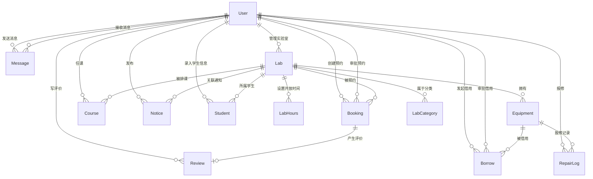

# 数据模型设计

> 基于需求规格文档 v1.0 | 2026-06-29

---

## 一、实体关系图



### 实体清单

| 实体        | 表名           | 说明                                    |
| ----------- | -------------- | --------------------------------------- |
| User        | users          | 用户（学生/教师/管理员），RBAC 三级角色 |
| Lab         | labs           | 实验室信息                              |
| LabHours    | lab_hours      | 实验室每周开放时段                      |
| LabCategory | lab_categories | 实验室分类（如"计算机组成原理实验室"）  |
| Equipment   | equipment      | 设备资产                                |
| Booking     | bookings       | 预约记录（核心）                        |
| Borrow      | borrows        | 设备借用记录                            |
| Course      | courses        | 课程安排                                |
| Review      | reviews        | 实验室评价（关联到已完成预约）          |
| Notice      | notices        | 通知公告                                |
| Student     | students       | 学生/人员信息（管理员录入）             |
| Message     | messages       | 站内消息                                |
| RepairLog   | repair_logs    | 设备报修记录                            |

---

## 二、核心实体字段说明

### User

| 字段       | 类型         | 说明                      |
| ---------- | ------------ | ------------------------- |
| id         | BIGINT       | 主键，自增                |
| username   | VARCHAR(50)  | 学号/工号，唯一           |
| real_name  | VARCHAR(50)  | 真实姓名                  |
| password   | VARCHAR(255) | BCrypt 加密               |
| email      | VARCHAR(100) | 邮箱，可选                |
| phone      | VARCHAR(20)  | 手机号，可选              |
| role       | ENUM         | STUDENT / TEACHER / ADMIN |
| avatar     | VARCHAR(255) | 头像 URL                  |
| enabled    | BOOLEAN      | 是否启用，默认 true       |
| created_at | DATETIME     |                           |
| updated_at | DATETIME     |                           |
| deleted_at | DATETIME     | 软删除                    |

### Lab

| 字段          | 类型         | 说明                             |
| ------------- | ------------ | -------------------------------- |
| id            | BIGINT       |                                  |
| name          | VARCHAR(100) | 实验室名称                       |
| location      | VARCHAR(200) | 位置                             |
| capacity      | INT          | 容纳人数                         |
| description   | TEXT         | 描述                             |
| image_url     | VARCHAR(255) | 照片 URL                         |
| equipment_num | INT          | 设备数量（冗余计数器）           |
| status        | ENUM         | AVAILABLE / MAINTENANCE / CLOSED |
| manager_id    | BIGINT       | 实验室管理员 FK→User             |

### LabHours

| 字段        | 类型        | 说明          |
| ----------- | ----------- | ------------- |
| id          | BIGINT      |               |
| lab_id      | BIGINT      | FK→Lab        |
| day_of_week | TINYINT     | 1=Mon … 7=Sun |
| open_time   | VARCHAR(10) | "08:00"       |
| close_time  | VARCHAR(10) | "21:00"       |

约束：`UNIQUE(lab_id, day_of_week, open_time)`

### Booking（核心）

| 字段          | 类型        | 说明                                                  |
| ------------- | ----------- | ----------------------------------------------------- |
| id            | BIGINT      |                                                       |
| lab_id        | BIGINT      | FK→Lab                                                |
| user_id       | BIGINT      | 申请人 FK→User                                        |
| date          | DATE        | 预约日期                                              |
| start_time    | VARCHAR(10) | "14:00"                                               |
| end_time      | VARCHAR(10) | "16:00"                                               |
| purpose       | TEXT        | 用途说明                                              |
| person_count  | INT         | 使用人数，默认 1                                      |
| status        | ENUM        | PENDING / APPROVED / REJECTED / CANCELLED / COMPLETED |
| reject_reason | TEXT        | 驳回原因                                              |
| approver_id   | BIGINT      | 审批人 FK→User                                        |
| approved_at   | DATETIME    | 审批时间                                              |
| completed_at  | DATETIME    | 完成时间                                              |

**状态流转**：

```
PENDING → APPROVED → COMPLETED
PENDING → REJECTED
PENDING → CANCELLED
APPROVED → CANCELLED
```

### Borrow

| 字段            | 类型   | 说明                                                 |
| --------------- | ------ | ---------------------------------------------------- |
| id              | BIGINT |                                                      |
| equipment_id    | BIGINT | FK→Equipment                                         |
| user_id         | BIGINT | 借用人 FK→User                                       |
| borrow_date     | DATE   | 借用日期                                             |
| expected_return | DATE   | 预计归还日期                                         |
| actual_return   | DATE   | 实际归还日期                                         |
| purpose         | TEXT   | 用途                                                 |
| status          | ENUM   | PENDING / APPROVED / REJECTED / BORROWING / RETURNED |
| reject_reason   | TEXT   | 驳回原因                                             |
| approver_id     | BIGINT | 审批人 FK→User                                       |

**状态流转**：

```
PENDING → APPROVED → BORROWING → RETURNED
PENDING → REJECTED
```

### Course

| 字段        | 类型         | 说明               |
| ----------- | ------------ | ------------------ |
| id          | BIGINT       |                    |
| name        | VARCHAR(100) | 课程名称           |
| lab_id      | BIGINT       | 上课实验室         |
| teacher_id  | BIGINT       | 任课教师 FK→User   |
| semester    | VARCHAR(20)  | 学期 "2025-2026-1" |
| day_of_week | TINYINT      | 1-7                |
| start_time  | VARCHAR(10)  |                    |
| end_time    | VARCHAR(10)  |                    |
| start_date  | DATE         | 课程开始日期       |
| end_date    | DATE         | 课程结束日期       |
| class_name  | VARCHAR(100) | 班级名称           |

---

## 三、索引设计

### 索引汇总表

| 表           | 索引列                                   | 类型               | 理由                                       |
| ------------ | ---------------------------------------- | ------------------ | ------------------------------------------ |
| users        | username                                 | UNIQUE             | 登录查询，用户名唯一                       |
| users        | role                                     | INDEX              | 用户管理按角色筛选                         |
| users        | enabled                                  | INDEX              | 过滤启用的用户                             |
| users        | deleted_at                               | INDEX              | 软删除过滤（MyBatis-Plus 自动拼接）        |
| labs         | status                                   | INDEX              | 按状态筛选可用实验室                       |
| labs         | name                                     | INDEX              | 按名称搜索实验室                           |
| labs         | deleted_at                               | INDEX              | 软删除过滤                                 |
| lab_hours    | lab_id                                   | INDEX              | 查询某实验室的所有开放时段                 |
| lab_hours    | `UNIQUE(lab_id, day_of_week, open_time)` | UNIQUE             | 同一实验室同一天同时段不重复               |
| equipment    | lab_id                                   | INDEX              | 查询某实验室下的设备                       |
| equipment    | status                                   | INDEX              | 按状态筛选可用/借出/维修                   |
| equipment    | name                                     | INDEX              | 按名称搜索设备                             |
| equipment    | serial_number                            | UNIQUE             | 序列号防重                                 |
| equipment    | deleted_at                               | INDEX              | 软删除过滤                                 |
| **bookings** | **(lab_id, date)**                       | **COMPOUND INDEX** | **时间冲突检测：同一实验室同一日期的预约** |
| bookings     | user_id                                  | INDEX              | "我的预约"列表查询                         |
| bookings     | status                                   | INDEX              | 待审批列表（按状态筛选）                   |
| bookings     | approver_id                              | INDEX              | 按审批人查询                               |
| bookings     | deleted_at                               | INDEX              | 软删除过滤                                 |
| reviews      | booking_id                               | UNIQUE             | 一次预约最多一条评价                       |
| reviews      | user_id                                  | INDEX              | "我的评价"查询                             |
| reviews      | deleted_at                               | INDEX              | 软删除过滤                                 |
| borrows      | equipment_id                             | INDEX              | 按设备查询借用记录                         |
| borrows      | user_id                                  | INDEX              | "我的借用"查询                             |
| borrows      | status                                   | INDEX              | 待审批列表                                 |
| borrows      | approver_id                              | INDEX              | 按审批人查询                               |
| borrows      | deleted_at                               | INDEX              | 软删除过滤                                 |
| courses      | lab_id, day_of_week                      | COMPOUND INDEX     | 时间冲突检测：查询某实验室某天的课程       |
| courses      | teacher_id                               | INDEX              | 某教师的课程列表                           |
| courses      | semester                                 | INDEX              | 按学期筛选                                 |
| courses      | deleted_at                               | INDEX              | 软删除过滤                                 |
| notices      | type                                     | INDEX              | 按类型筛选                                 |
| notices      | priority                                 | INDEX              | 按优先级筛选                               |
| notices      | created_at                               | INDEX              | 按发布时间排序                             |
| notices      | deleted_at                               | INDEX              | 软删除过滤                                 |
| messages     | receiver_id, is_read                     | COMPOUND INDEX     | 某用户的未读消息                           |
| messages     | sender_id                                | INDEX              | 已发送消息                                 |
| messages     | deleted_at                               | INDEX              | 软删除过滤                                 |
| students     | lab_id                                   | INDEX              | 按实验室分室筛选                           |
| students     | name                                     | INDEX              | 按姓名搜索                                 |
| students     | deleted_at                               | INDEX              | 软删除过滤                                 |
| repair_logs  | equipment_id                             | INDEX              | 某设备的报修记录                           |
| repair_logs  | status                                   | INDEX              | 按维修状态筛选                             |
| repair_logs  | deleted_at                               | INDEX              | 软删除过滤                                 |

### 索引设计原则

1. **时间冲突检测（P0 关键路径）**
   - `bookings(lab_id, date)` 联合索引是预约审批时检测时间冲突的最频繁查询
   - `courses(lab_id, day_of_week)` 联合索引用于周期性课程占用的冲突检测
   - 冲突检测逻辑：`lab_id + date/day_of_week + 时间段重叠判断`

2. **软删除贯穿所有表**
   - 所有业务表都有 `deleted_at` 字段，且建有索引
   - MyBatis-Plus 配置 `logic-delete-field: deleted` 自动在 WHERE 中追加 `deleted_at IS NULL`
   - 索引避免全表扫描区分已删除/未删除记录

3. **按用户/状态/审批人筛选是列表页的典型模式**
   - `user_id`、`status`、`approver_id` 分别对应"我的预约"、"待审批列表"、"我审批的"等视图

4. **唯一约束防止重复**
   - `users.username`、`equipment.serial_number`、`lab_hours(lab_id, day_of_week, open_time)`、`reviews.booking_id` 分别防止：用户名重复、设备序列号重复、开放时段重复、一次预约多条评价

---

## 四、审计与软删除

### 审计字段（所有业务表均有）

| 字段       | 说明                                                                         |
| ---------- | ---------------------------------------------------------------------------- |
| created_at | DATETIME, DEFAULT CURRENT_TIMESTAMP, 由 MyBatis-Plus `insertFill` 自动填充   |
| updated_at | DATETIME, ON UPDATE CURRENT_TIMESTAMP, 由 MyBatis-Plus `updateFill` 自动填充 |

MyBatis-Plus 配置（已存在于 `application.yml`）：

```yaml
mybatis-plus:
  global-config:
    db-config:
      logic-delete-field: deleted
      logic-delete-value: 1
      logic-not-delete-value: 0
```

> 注意：当前配置使用 `0`/`1`（INT），但本 Prisma schema 使用 `DateTime?`。
> 实际建表时可用 DATETIME 类型（推荐），MyBatis-Plus 也支持。
> 如果坚持 INT，将 `deletedAt` 改为 `deleted TINYINT DEFAULT 0`。
>
> **建议**：使用 DATETIME 方案（更有利于数据追溯，查询 `WHERE deleted_at IS NULL` 效果与 `WHERE deleted = 0` 相同，且能记录删除时间）。

### 软删除设计原则

- 所有 `DELETE` 操作转换为 `UPDATE deleted_at = NOW()`
- 所有 `SELECT` 自动追加 `AND deleted_at IS NULL`
- `UNIQUE` 约束需要包含 `deleted_at` 或改为数据库级别的部分唯一索引（MySQL 8.0 不支持条件唯一索引，因此：
  - `username`：不删除同名用户（软删除后有唯一记录），重新注册相同用户名会冲突 → 解决方案：软删除时追加时间戳后缀 `username_del_<timestamp>`
  - `serial_number`：同逻辑处理

---

## 五、多租户隔离

当前系统为**单机构**模式（高校内部使用），不涉及 SaaS 多租户。如果后续需要学校级别的多租户隔离：

1. 所有业务表增加 `tenant_id BIGINT`
2. 所有唯一约束加上 `tenant_id`（如 `UNIQUE(tenant_id, username)`）
3. 所有索引前缀补 `tenant_id`
4. SQL 使用 MyBatis-Plus 多租户插件自动拼接 `tenant_id = ?` 条件

当前版本无需实现。

---

## 六、与 MyBatis-Plus 的映射关系

本项目 ORM 是 MyBatis-Plus，不是 Prisma。此 Prisma schema 是**设计文档性质的参考**。

对应关系：

| Prisma 概念                    | MyBatis-Plus 对应                      |
| ------------------------------ | -------------------------------------- |
| model → @@map("table")         | `@TableName("table")`                  |
| 字段类型                       | Java 实体字段 + `@TableField`          |
| @@id @default(autoincrement()) | `@TableId(type = IdType.AUTO)`         |
| @@unique                       | `@TableField` + `UNIQUE KEY` SQL       |
| @@index                        | `KEY idx_xxx (col)` SQL                |
| @updatedAt                     | `@TableField(fill = FieldFill.UPDATE)` |
| @default(now())                | `@TableField(fill = FieldFill.INSERT)` |
| 关系（@relation）              | MyBatis-Plus 不管理关系，手动 JOIN     |
| 软删除 @map("deleted_at")      | `logic-delete-field: deleted` 配置项   |
| ENUM                           | Java Enum + MySQL VARCHAR/ENUM         |
