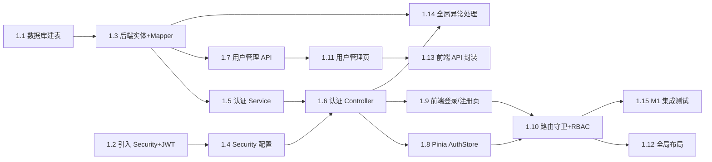
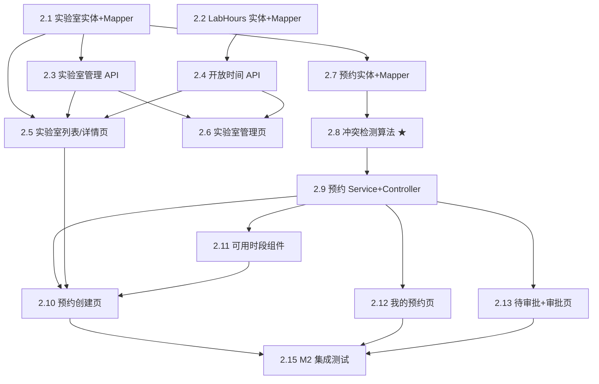
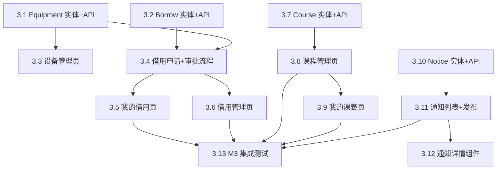
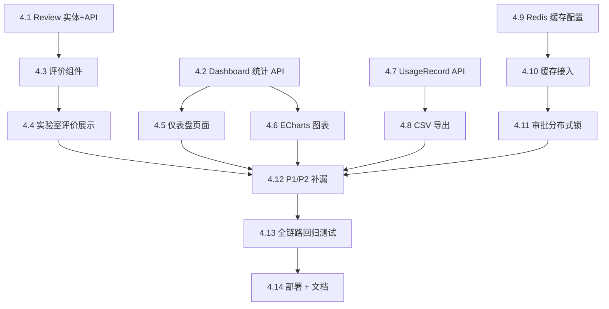

# 开发计划

> 版本：1.0 | 日期：2026-06-29 | 基于需求规格 v1.0 + 架构 v1.0 + 风险评估 v1.0

---

## 目录

1. [里程碑概览](#一里程碑概览)
2. [M1: 基础设施 + 认证](#二m1-基础设施--认证-day-12)
3. [M2: 预约核心闭环](#三m2-预约核心闭环-day-35)
4. [M3: 设备 + 课程 + 通知](#四m3-设备--课程--通知-day-67)
5. [M4: 评价 + 统计 + 收尾](#五m4-评价--统计--收尾-day-810)
6. [关键路径分析](#六关键路径分析)
7. [时间估算汇总](#七时间估算汇总)

---

## 一、里程碑概览

```
M1 ────────────▶ M2 ────────────▶ M3 ────────────▶ M4
Day 1-2          Day 3-5          Day 6-7          Day 8-10
基础设施+认证    预约核心闭环      设备+课程+通知    评价+统计+收尾

每个里程碑都是一个可独立部署和演示的版本。
```

| 里程碑                    | 天数     | 任务数 | 可演示内容                                                | 退出条件                       |
| ------------------------- | -------- | ------ | --------------------------------------------------------- | ------------------------------ |
| **M1** 基础设施 + 认证    | Day 1-2  | 15     | 注册、登录、角色菜单切换、用户管理                        | 三种角色能登录并看到不同的主页 |
| **M2** 预约核心闭环       | Day 3-5  | 18     | 浏览实验室 → 查可用时段 → 提交预约 → 审批/驳回 → 我的预约 | **预约全链路可走通**           |
| **M3** 设备 + 课程 + 通知 | Day 6-7  | 13     | 设备 CRUD、借用申请/审批/归还、课程安排、通知发布         | 设备借用和课程排课可走通       |
| **M4** 评价 + 统计 + 收尾 | Day 8-10 | 14     | 仪表盘 KPI、使用率图表、评价、CSV 导出                    | 所有 P0+P1 完成，P2 视进度     |

**时间估算说明：**

每个任务给出三个估值（单位：小时）：

- **O** = 乐观 (Optimistic) — 一切顺利
- **P** = 悲观 (Pessimistic) — 遇到阻塞
- **ML** = 最可能 (Most Likely) — 正常节奏

期望工期 = (O + 4×ML + P) / 6（PERT 加权）。

---

## 二、M1: 基础设施 + 认证 (Day 1-2)

**目标：** 三端基础环境跑通，用户能注册、登录，不同角色看到不同界面。

**可演示项：** 注册 → 登录 → 页面根据角色显示不同菜单 → 管理员可查看用户列表。



### 任务清单

| ID       | 任务                                                                                                                                        | 层  | O   | ML  | P   | 依赖      | 关键路径 |
| -------- | ------------------------------------------------------------------------------------------------------------------------------------------- | --- | --- | --- | --- | --------- | -------- |
| **1.1**  | **数据库建表** — 编写 `init.sql`，创建 14 张表 + 索引 + 预置测试数据（3 个角色的用户、2 个实验室）                                          | BE  | 1.0 | 2.0 | 3.0 | —         | ★        |
| **1.2**  | **引入 Security + JWT 依赖** — pom.xml 添加 spring-boot-starter-security、jjwt-api/impl/jackson，验证编译通过                               | BE  | 0.5 | 0.5 | 1.0 | —         | ★        |
| **1.3**  | **后端实体 + Mapper** — 创建 14 个 Entity 类（@TableName + @TableId + @TableLogic）+ 14 个 Mapper 接口（extends BaseMapper）                | BE  | 1.5 | 2.0 | 3.0 | 1.1       | ★        |
| **1.4**  | **Security 配置** — SecurityConfig（Filter Chain DSL）+ JwtUtil（生成/解析/校验）+ JwtAuthenticationFilter（OncePerRequestFilter）          | BE  | 2.0 | 3.0 | 5.0 | 1.2       | ★        |
| **1.5**  | **认证 Service** — AuthService（register/login/me）+ UserDetailsService（loadUserByUsername）+ BCrypt 密码编码器                            | BE  | 1.5 | 2.0 | 3.0 | 1.3, 1.4  | ★        |
| **1.6**  | **认证 Controller** — POST /auth/register、POST /auth/login、GET /auth/me、PUT /auth/change-password                                        | BE  | 1.0 | 1.5 | 2.5 | 1.5       | ★        |
| **1.7**  | **用户管理 API** — UserService + UserController：GET/POST/PUT/DELETE /users、PUT /users/{id}/toggle-enabled                                 | BE  | 1.5 | 2.0 | 3.0 | 1.3       | ★        |
| **1.8**  | **Pinia AuthStore** — useAuthStore（token/userInfo/login/logout）+ localStorage 持久化 + Axios 拦截器自动附加 token                         | FE  | 1.0 | 1.5 | 2.5 | —         | ★        |
| **1.9**  | **登录/注册页面** — LoginView.vue + RegisterView.vue（Element Plus 表单校验）                                                               | FE  | 1.5 | 2.0 | 3.0 | 1.8       | ★        |
| **1.10** | **路由守卫 + RBAC** — router.beforeEach 检查 token + 角色 → 动态路由 / 重定向                                                               | FE  | 1.0 | 1.5 | 2.5 | 1.8, 1.9  | ★        |
| **1.11** | **用户管理页面** — AdminUsersView.vue（列表 + 创建弹窗 + 编辑弹窗 + 禁用开关）                                                              | FE  | 1.5 | 2.5 | 4.0 | 1.7, 1.10 |          |
| **1.12** | **全局布局** — AppLayout.vue（侧边栏 + 顶栏 + RouterView）+ 角色差异化菜单（v-for 过滤菜单项）                                              | FE  | 1.5 | 2.0 | 3.0 | 1.10      |          |
| **1.13** | **前端 API 封装** — `api/client.ts`（Axios 实例 + 响应拦截器统一错误处理）+ 各模块 API 文件（auth.ts, users.ts）                            | FE  | 1.0 | 1.5 | 2.0 | —         |          |
| **1.14** | **全局异常处理** — @RestControllerAdvice（BusinessException + MethodArgumentNotValidException + AccessDeniedException）→ 统一 ApiError 响应 | BE  | 1.0 | 1.5 | 2.0 | 1.3, 1.6  |          |
| **1.15** | **M1 集成测试** — 用 Apifox/Postman 走一遍注册→登录→获取用户→管理用户，前端 E2E：登录后页面正确跳转                                         | QA  | 1.0 | 1.5 | 2.0 | 全部      | ★        |

**M1 合计：** 乐观 17.5h / 最可能 25.5h / 悲观 40.5h → PERT 期望 **25.6h (≈ 3.2 天)**

### M1 关键路径

```
1.1 建表 → 1.3 实体+Mapper → 1.5 认证Service → 1.6 认证Controller
1.2 引入依赖 → 1.4 Security配置 → 1.5
                                               ↓
1.8 AuthStore → 1.9 登录注册页 → 1.10 路由守卫 → 1.15 集成测试
```

> **Day 1 结束检查点：** 后端认证接口可调通（POST /auth/register → POST /auth/login 返回有效 token）
> **Day 2 结束检查点：** 前端登录页可登录，三种角色看到不同菜单，管理员可查看用户列表

---

## 三、M2: 预约核心闭环 (Day 3-5)

**目标：** 预约全链路走通 —— 学生浏览实验室 → 查可用时段 → 提交预约 → 教师审批 → 状态流转。

**可演示项：** 完整的预约生命周期（含时间冲突检测）。



### 任务清单

| ID       | 任务                                                                                                                                                                                        | 层  | O   | ML  | P   | 依赖           | 关键路径 |
| -------- | ------------------------------------------------------------------------------------------------------------------------------------------------------------------------------------------- | --- | --- | --- | --- | -------------- | -------- |
| **2.1**  | **Lab 实体 + Mapper + Service** — Lab 实体、LabMapper（含按名称/状态筛选的分页查询）                                                                                                        | BE  | 0.5 | 1.0 | 1.5 | M1 完成        | ★        |
| **2.2**  | **LabHours 实体 + Mapper** — LabHours 实体、批量 upsert 的自定义 SQL                                                                                                                        | BE  | 0.5 | 1.0 | 1.5 | M1 完成        | ★        |
| **2.3**  | **实验室管理 API** — LabController：GET/POST/PUT/DELETE /labs、PUT /labs/{id}/status，含 @PreAuthorize                                                                                      | BE  | 1.0 | 1.5 | 2.5 | 2.1            | ★        |
| **2.4**  | **开放时间 API** — LabHoursController：GET/PUT /labs/{id}/hours，全量替换逻辑                                                                                                               | BE  | 0.5 | 1.0 | 2.0 | 2.2            | ★        |
| **2.5**  | **实验室列表/详情页** — LabsView.vue（搜索 + 状态筛选 + 卡片列表）、LabDetailView.vue（含开放时间 + 设备列表）                                                                              | FE  | 2.0 | 3.0 | 5.0 | 2.3            | ★        |
| **2.6**  | **实验室管理页** — AdminLabsView.vue（CRUD 表格 + 弹窗表单 + 开放时间批量设置）                                                                                                             | FE  | 1.5 | 2.5 | 4.0 | 2.3, 2.4       |          |
| **2.7**  | **Booking 实体 + Mapper** — 含自定义查询：按 labId+date 查已审批预约、按 userId 查我的预约、按 status 查待审批                                                                              | BE  | 1.0 | 1.5 | 2.0 | M1 完成        | ★        |
| **2.8**  | **冲突检测算法 ★ 最高风险** — TimeConflictResolver 纯函数 + 9 个边界 case 的 JUnit 5 @ParameterizedTest（完全重叠/部分重叠/首尾相连/包含/跨天/不同日期/不同实验室/与课程冲突/与已审批冲突） | BE  | 2.0 | 3.0 | 5.0 | 2.7            | ★        |
| **2.9**  | **预约 Service + Controller** — BookingService（create/approve/cancel/complete/getAvailableSlots）+ BookingController（6 个接口）                                                           | BE  | 2.0 | 3.0 | 5.0 | 2.7, 2.8       | ★        |
| **2.10** | **预约创建页** — BookingCreateView.vue（日期选择器 + 可用时段网格 + 用途表单），含客户端时段冲突提示                                                                                        | FE  | 2.0 | 3.0 | 5.0 | 2.5, 2.9, 2.11 | ★        |
| **2.11** | **可用时段组件** — TimeSlotPicker.vue（获取 available-slots API → 渲染绿色可用/灰色不可用网格 → 支持点击选中时段），可复用                                                                  | FE  | 1.0 | 2.0 | 3.0 | 2.9            | ★        |
| **2.12** | **我的预约页** — MyBookingsView.vue（状态筛选 + 卡片列表 + 取消按钮 + 状态标签颜色）                                                                                                        | FE  | 1.5 | 2.0 | 3.5 | 2.9            |          |
| **2.13** | **待审批 + 审批页** — PendingApprovalsView.vue（待审批列表 + 通过/驳回弹窗 + 冲突详情提示）                                                                                                 | FE  | 1.5 | 2.5 | 4.0 | 2.9            |          |
| **2.14** | **Axios 请求/响应拦截器增强** — 401 自动跳转登录、网络错误 Toast 提示、loading 状态管理                                                                                                     | FE  | 0.5 | 1.0 | 1.5 | M1 完成        |          |
| **2.15** | **M2 集成测试** — 端到端走查：管理员创建实验室 → 设开放时间 → 学生查可用时段 → 提交预约 → 教师审批通过 → 学生确认状态 → 教师确认完成 + 异常场景：提交冲突预约 → 预期 409                    | QA  | 1.5 | 2.0 | 3.0 | 全部           | ★        |

**M2 合计：** 乐观 18.5h / 最可能 27.5h / 悲观 45.5h → PERT 期望 **28.1h (≈ 3.5 天)**

> 注：M1 + M2 累计 PERT = 53.7h。按每天 8h 计 = 6.7 天。需压缩非关键路径任务以在 Day 5 前走通。

### M2 关键路径

```
2.7 Booking实体 → 2.8 冲突检测 → 2.9 预约Service+Controller → 2.11 可用时段组件 → 2.10 预约创建页 → 2.15 集成测试
                                                                            ↘
                                                              2.12 我的预约页
                                                              2.13 审批页
```

> **Day 3 结束检查点：** 冲突检测算法通过所有 9 个边界 case 的单元测试
> **Day 4 结束检查点：** POST /bookings → PUT /approve → GET /bookings/mine 可调通
> **Day 5 结束检查点：** 前端预约全链路可走通（创建→审批→完成），M2 可演示

---

## 四、M3: 设备 + 课程 + 通知 (Day 6-7)

**目标：** 完成设备借用生命周期 + 课程安排 + 通知系统。

**可演示项：** 完整的设备借用流程 + 课表查看 + 通知列表。



### 任务清单

| ID       | 任务                                                                                                                                              | 层  | O   | ML  | P   | 依赖     | 关键路径 |
| -------- | ------------------------------------------------------------------------------------------------------------------------------------------------- | --- | --- | --- | --- | -------- | -------- |
| **3.1**  | **Equipment 实体 + API** — 实体、Mapper、Service、Controller（CRUD + 按 labId/status/name 筛选）                                                  | BE  | 1.0 | 1.5 | 2.5 | M2 完成  | ★        |
| **3.2**  | **Borrow 实体 + API** — 实体、Mapper、Service（含借用状态机校验：PENDING→APPROVED→BORROWING→RETURNED）+ Controller（含 /mine、/approve、/return） | BE  | 1.5 | 2.5 | 4.0 | M2 完成  | ★        |
| **3.3**  | **设备管理页** — AdminEquipmentView.vue（表格 CRUD + 状态标签 + 序列号唯一校验提示）                                                              | FE  | 1.5 | 2.0 | 3.5 | 3.1      |          |
| **3.4**  | **借用申请 + 审批流程** — BorrowRequestView.vue（设备选择器 + 日期范围 + 用途）+ 管理员审批/归还操作                                              | FE  | 2.0 | 3.0 | 5.0 | 3.1, 3.2 | ★        |
| **3.5**  | **我的借用页** — MyBorrowsView.vue（状态筛选 + 时间线展示 + 状态标签）                                                                            | FE  | 1.0 | 1.5 | 2.5 | 3.2      |          |
| **3.6**  | **借用管理页** — AdminBorrowsView.vue（全部借用记录 + 待审批/借用中 tab 切换 + 归还确认）                                                         | FE  | 1.0 | 1.5 | 2.5 | 3.2      |          |
| **3.7**  | **Course 实体 + API** — 实体、Mapper、Service（含学期校验 isValidSemester）、Controller（CRUD + /mine 按班级/教师查询）                           | BE  | 1.0 | 1.5 | 2.5 | M2 完成  | ★        |
| **3.8**  | **课程管理页** — AdminCoursesView.vue（课表日历视图 + 创建/编辑弹窗 + 学期下拉）                                                                  | FE  | 2.0 | 3.0 | 5.0 | 3.7      | ★        |
| **3.9**  | **我的课表页** — MyScheduleView.vue（按学期筛选 + 周课表时间轴展示）                                                                              | FE  | 1.5 | 2.5 | 4.0 | 3.7      |          |
| **3.10** | **Notice 实体 + API** — 实体、Mapper、Service、Controller（CRUD + 按 type/priority 筛选 + 按时间倒序）                                            | BE  | 0.5 | 1.0 | 1.5 | M2 完成  |          |
| **3.11** | **通知列表 + 发布** — NoticesView.vue（类型筛选 + 优先级标签 + 时间线）+ AdminNoticeCreate.vue（富文本编辑 + 关联实验室选择）                     | FE  | 1.5 | 2.0 | 3.5 | 3.10     |          |
| **3.12** | **通知详情组件** — NoticeDetail.vue（弹窗/抽屉展示完整内容 + 关联实验室跳转）                                                                     | FE  | 0.5 | 1.0 | 1.5 | 3.11     |          |
| **3.13** | **M3 集成测试** — 设备借用全流程 + 课程安排与课表查询 + 通知发布与列表拉取                                                                        | QA  | 1.0 | 1.5 | 2.0 | 全部     | ★        |

**M3 合计：** 乐观 14.0h / 最可能 21.5h / 悲观 36.5h → PERT 期望 **21.8h (≈ 2.7 天)**

### M3 关键路径

```
3.1 Equipment API → 3.4 借用申请+审批流程 → 3.13 集成测试
3.2 Borrow API ────→ 3.4
3.7 Course API → 3.8 课程管理页 → 3.13
```

> **Day 6 结束检查点：** Equipment + Borrow + Course 后端 API 调通
> **Day 7 结束检查点：** 前端设备借用和课程页面可用，M3 可演示

---

## 五、M4: 评价 + 统计 + 收尾 (Day 8-10)

**目标：** 仪表盘、评价系统、Redis 缓存、CSV 导出、bug 修复、文档。

**可演示项：** Dashboard KPI + ECharts 图表 + 评价评分 + CSV 导出文件。



### 任务清单

| ID       | 任务                                                                                                                                                                          | 层     | O   | ML  | P   | 依赖        | 关键路径 |
| -------- | ----------------------------------------------------------------------------------------------------------------------------------------------------------------------------- | ------ | --- | --- | --- | ----------- | -------- |
| **4.1**  | **Review 实体 + API** — 实体（含 bookingId UNIQUE）、Service（校验 booking.status=COMPLETED）+ Controller（CRUD + /mine）                                                     | BE     | 0.5 | 1.0 | 2.0 | M2 完成     |          |
| **4.2**  | **Dashboard 统计 API** — DashboardService（SQL 聚合：今日预约/借用数、使用率、待审批数、实验室/设备排行）+ Controller（/kpi、/lab-usage、/equipment-usage、/student-ranking） | BE     | 1.5 | 2.5 | 4.0 | M2, M3 完成 | ★        |
| **4.3**  | **评价组件** — ReviewForm.vue（星级评分组件 + 文字输入 + 提交）+ 在预约完成页面嵌入评价入口                                                                                   | FE     | 1.0 | 1.5 | 3.0 | 4.1         |          |
| **4.4**  | **实验室评价展示** — LabDetailView 底部追加评价列表（星级 + 文字 + 用户名 + 时间）+ 平均分统计                                                                                | FE     | 0.5 | 1.0 | 2.0 | 4.1, 4.3    |          |
| **4.5**  | **仪表盘页面** — DashboardView.vue（4 个 KPI 卡片：今日预约/借用/使用率/待审批）+ 角色差异化（学生看自己统计，教师/管理员看全局）                                             | FE     | 1.5 | 2.0 | 3.5 | 4.2         | ★        |
| **4.6**  | **ECharts 图表** — LabUsageChart.vue（柱状图：各实验室使用次数）+ EquipmentUsageChart.vue（饼图：设备状态分布）+ 学生排行表格                                                 | FE     | 1.5 | 2.5 | 4.0 | 4.2         |          |
| **4.7**  | **UsageRecord API + CSV 导出** — 使用记录查询 Service + Controller + CSV 生成（OpenCSV 或手动 StringBuilder 拼接）+ Content-Type: text/csv                                    | BE     | 1.0 | 1.5 | 2.5 | M2 完成     |          |
| **4.8**  | **CSV 导出按钮** — 使用记录页面的导出按钮（触发下载）+ 日期范围筛选                                                                                                           | FE     | 0.5 | 1.0 | 2.0 | 4.7         |          |
| **4.9**  | **Redis 缓存配置** — RedissonClient Bean + CacheManager 配置（Jackson 序列化 + TTL 默认 5min）+ application.yml 缓存 profile                                                  | BE     | 1.0 | 1.5 | 2.5 | M2 完成     | ★        |
| **4.10** | **缓存接入** — 对高频查询加 @Cacheable：实验室列表（TTL 5min）、用户信息（TTL 10min）、KPI 数据（TTL 5min）+ @CacheEvict 在更新时清除                                         | BE     | 1.0 | 1.5 | 2.5 | 4.9         | ★        |
| **4.11** | **审批分布式锁** — 在 BookingService.approve() 和 BorrowService.approve() 中加 Redisson tryLock + watchdog，锁粒度 booking:{id} / borrow:{id}                                 | BE     | 1.0 | 1.5 | 3.0 | 4.9         | ★        |
| **4.12** | **P1/P2 补漏** — 预约取消/修改（F-17/F-18）+ 实验室状态管理（F-11）+ 学生信息管理（students CRUD）+ 报修记录（repair-logs CRUD）                                              | BE+FE  | 1.5 | 2.5 | 4.0 | 全部        | ★        |
| **4.13** | **全链路回归测试** — 执行 5 个核心 User Story 的 E2E 测试脚本 + 安全测试 checklist（越权/XSS/SQL 注入）+ 所有 Vitest + JUnit 5 测试确保通过                                   | QA     | 2.0 | 3.0 | 5.0 | 全部        | ★        |
| **4.14** | **部署 + 文档** — 编写 Dockerfile（多阶段构建）+ docker-compose.prod.yml + Nginx 配置 + README 更新 + 接口文档最终检查                                                        | DevOps | 1.0 | 2.0 | 3.0 | 4.13        | ★        |

**M4 合计：** 乐观 14.0h / 最可能 21.5h / 悲观 36.5h → PERT 期望 **21.8h (≈ 2.7 天)**

### M4 关键路径

```
4.9 Redis配置 → 4.10 缓存接入 → 4.11 审批分布式锁 → 4.12 P1/P2补漏 → 4.13 回归测试 → 4.14 部署+文档
4.2 Dashboard API → 4.5 仪表盘页面 → 4.12
```

> **Day 8 结束检查点：** 仪表盘 KPI 和图表可展示，评价功能可用
> **Day 9 结束检查点：** Redis 缓存 + 分布式锁接入完成，P1/P2 补漏完成
> **Day 10 结束检查点：** 全链路回归测试通过，Docker 部署可用

---

## 六、关键路径分析

### 6.1 全网关键路径

将四个里程碑串联，得到整个项目的关键路径（最长依赖链）：

```
M1:
1.1 建表(2h) → 1.3 实体+Mapper(2h) → 1.5 认证Service(2h) → 1.6 认证Controller(1.5h)
1.2 引入依赖(0.5h) → 1.4 Security配置(3h) → 1.5
→ 1.14 全局异常(1.5h)
→ 前端: 1.8 AuthStore(1.5h) → 1.9 登录注册页(2h) → 1.10 路由守卫(1.5h) → 1.15 M1集成测试(1.5h)
M1 关键路径长度: 14.5h ML

M2:
2.7 Booking实体(1.5h) → 2.8 冲突检测(3h) → 2.9 预约Service(3h) → 2.11 可用时段组件(2h) → 2.10 预约创建页(3h) → 2.15 M2集成测试(2h)
M2 关键路径长度: 14.5h ML

M3:
3.1 Equipment API(1.5h) → 3.4 借用申请流程(3h) → 3.13 M3集成测试(1.5h)
3.7 Course API(1.5h) → 3.8 课程管理页(3h) → 3.13
M3 关键路径长度: 6.0h ML (取最长: Equipment → Borrow 分支)

M4:
4.9 Redis配置(1.5h) → 4.10 缓存接入(1.5h) → 4.11 分布式锁(1.5h) → 4.12 P1/P2补漏(2.5h) → 4.13 回归测试(3h) → 4.14 部署文档(2h)
4.2 Dashboard API(2.5h) → 4.5 仪表盘页面(2h) → 4.12
M4 关键路径长度: 12.0h ML (Redis分支 + Dashboard分支汇入补漏 → 测试 → 部署)
```

### 6.2 项目总关键路径

```
M1(14.5h) → M2(14.5h) → M3(6.0h) → M4(12.0h) = 47.0h ML
```

按每天 8 有效工时计算：**47 ÷ 8 ≈ 5.9 天**完成关键路径。

加上非关键路径的并行任务 + 联调 buffer，总计约 **8 天**（与 10 天计划有 2 天 buffer）。

### 6.3 关键路径上的任务（★标记）

| 里程碑 | 关键任务数 / 总任务数 | 关键任务                                                 |
| ------ | --------------------- | -------------------------------------------------------- |
| M1     | 11 / 15               | 1.1, 1.2, 1.3, 1.4, 1.5, 1.6, 1.7, 1.8, 1.9, 1.10, 1.15  |
| M2     | 10 / 15               | 2.1, 2.2, 2.3, 2.4, 2.5, 2.7, 2.8, 2.9, 2.10, 2.11, 2.15 |
| M3     | 6 / 13                | 3.1, 3.2, 3.4, 3.7, 3.8, 3.13                            |
| M4     | 8 / 14                | 4.2, 4.5, 4.9, 4.10, 4.11, 4.12, 4.13, 4.14              |

**关键路径任务 = 35 / 60 总任务 (58%)**

---

## 七、时间估算汇总

### 7.1 里程碑耗时（PERT 加权）

| 里程碑                 | 乐观 (h) | 最可能 (h) | 悲观 (h)  | PERT 期望 (h) | 天数     |
| ---------------------- | -------- | ---------- | --------- | ------------- | -------- |
| M1: 基础设施 + 认证    | 17.5     | 25.5       | 40.5      | 25.6          | 3.2      |
| M2: 预约核心闭环       | 18.5     | 27.5       | 45.5      | 28.1          | 3.5      |
| M3: 设备 + 课程 + 通知 | 14.0     | 21.5       | 36.5      | 21.8          | 2.7      |
| M4: 评价 + 统计 + 收尾 | 14.0     | 21.5       | 36.5      | 21.8          | 2.7      |
| **合计**               | **64.0** | **96.0**   | **159.0** | **97.3**      | **12.2** |

> PERT 总期望 = 97.3h ≈ **12.2 天**。这是单人全栈开发的估算。如果是 2 人（前后端各 1），可压缩至约 7-8 天。10 天计划在 1 人场景下偏紧，在 2 人场景下可行。

### 7.2 按角色分配

| 角色             | M1    | M2    | M3    | M4   | 合计      |
| ---------------- | ----- | ----- | ----- | ---- | --------- |
| 后端 (BE)        | 9.5h  | 11.5h | 7.0h  | 8.5h | **36.5h** |
| 前端 (FE)        | 14.0h | 14.0h | 13.0h | 7.5h | **48.5h** |
| 测试/DevOps (QA) | 2.0h  | 2.0h  | 1.5h  | 5.5h | **11.0h** |

如果是双人团队（1 BE + 1 FE），前后端可完全并行，总工期约 **7-8 天**。

### 7.3 里程碑依赖关系

```
M1 ────────────▶ M2 ────────────▶ M3 ────────────▶ M4
    (硬依赖)        (硬依赖)        (硬依赖)        (硬依赖)

M1 不完成 → 无法进入 M2（后端实体、Security 是所有业务接口的基础）
M2 不完成 → 无法进入 M3（Borrow/Course/Notice 依赖 Lab 实体）
M3 不完成 → 不影响 M4 个别任务（Review、Dashboard 仅依赖 M2 Booking 数据）

M4 的 4.9-4.11 (Redis) 与 M3 可并行：
  - M3 完成后立即开始 4.9 Redis 配置，不等前端页面完成
```

### 7.4 风险缓冲

基于风险评估 (R-S01: 70% 概率完不成)，内置两级缓冲：

| 级别     | 触发条件                                   | 应对                                                                     | 预计回收时间 |
| -------- | ------------------------------------------ | ------------------------------------------------------------------------ | ------------ |
| **黄色** | Day 3 结束时 M1 未完成                     | 砍 M3/M4 非关键路径：Notice 详情(3.12)、借用管理页(3.6)、报告管理页(3.6) | 3-4h         |
| **红色** | Day 5 结束时 M2 关键路径（冲突检测）未完成 | 砍 M3 全部 + M4 评价(4.1/4.3/4.4)，守住 M2 预约闭环 + 简单设备借用       | 1.5-2 天     |

---

## 附录 A: 任务状态标记说明

| 符号   | 含义                               |
| ------ | ---------------------------------- |
| ★      | 关键路径任务（延迟会推迟整个项目） |
| BE     | 后端任务                           |
| FE     | 前端任务                           |
| QA     | 测试 / 质量任务                    |
| DevOps | 部署 / 基础设施任务                |

## 附录 B: 每日站会检查清单

### Day 1

- [ ] MySQL + Redis Docker 是否正常启动？
- [ ] pom.xml 依赖是否全部 resolve 成功？
- [ ] POST /auth/register → /auth/login 是否返回有效 JWT？

### Day 2

- [ ] 三种角色登录后看到不同菜单？
- [ ] 全局异常处理是否统一返回 ApiError 格式？
- [ ] 前端路由守卫是否正确拦截未登录访问？

### Day 3

- [ ] TimeConflictResolver 的 9 个参数化测试是否全部通过？
- [ ] 实验室列表 API 是否按名称/状态筛选正常？

### Day 4

- [ ] 预约创建 → 审批 → 状态更新是否可调通？
- [ ] 可用时段 API 是否正确排除已审批预约和课程？

### Day 5

- [ ] 前端预约全链路（创建→审批→完成）是否可演示？
- [ ] M2 退出条件：预约闭环走通？

### Day 6

- [ ] Equipment + Borrow + Course 后端 API 是否可调通？
- [ ] 借用状态机流转是否正确（PENDING→APPROVED→BORROWING→RETURNED）？

### Day 7

- [ ] 设备借用和课程管理前端页面是否可用？
- [ ] 通知发布 → 列表拉取是否正常？

### Day 8

- [ ] 仪表盘 4 个 KPI 数据是否正确？
- [ ] ECharts 图表是否正常渲染？

### Day 9

- [ ] Redis 缓存命中率是否 > 50%？
- [ ] 分布式锁在并发审批时是否生效？

### Day 10

- [ ] 5 个核心 User Story E2E 测试是否通过？
- [ ] Docker compose up 是否能一键启动全栈？
